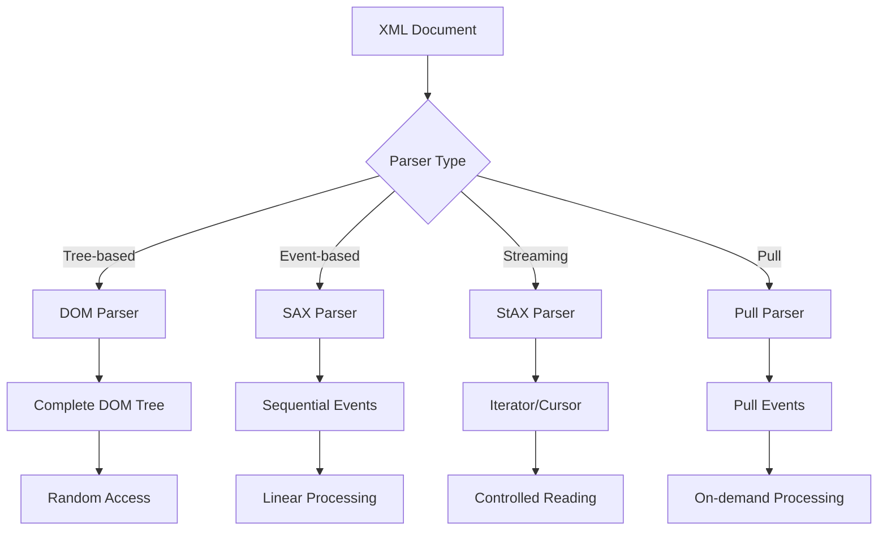

# ⚡ Module 3: Parsing Performance & Optimization

**Duration**: 4-5 days | **Difficulty**: Expert | **Prerequisites**: Basic XML Parsing, Advanced XSD

## 📚 Table of Contents

1. [Parsing Model Deep Dive](#parsing-model-deep-dive)
2. [DOM vs SAX vs StAX Comparison](#dom-vs-sax-vs-stax-comparison)
3. [Streaming Large XML Files](#streaming-large-xml-files)
4. [Memory Optimization Strategies](#memory-optimization-strategies)
5. [Schema-Aware Parsing](#schema-aware-parsing)
6. [Performance Benchmarking](#performance-benchmarking)
7. [Concurrent Processing](#concurrent-processing)
8. [Error Handling & Recovery](#error-handling--recovery)
9. [Real-World Optimization Cases](#real-world-optimization-cases)
10. [Advanced Performance Tuning](#advanced-performance-tuning)

---

## 🧠 Parsing Model Deep Dive

### Understanding XML Parsing Approaches



### Memory Usage Patterns

| Parser Type | Memory Usage | Processing Speed | Random Access | Stream Processing |
|-------------|--------------|------------------|---------------|-------------------|
| **DOM**     | O(n) - Full tree | Slow build, Fast access | ✅ Full | ❌ No |
| **SAX**     | O(1) - Constant | Fast | ❌ No | ✅ Yes |
| **StAX**    | O(1) - Constant | Fast | ❌ No | ✅ Yes |
| **Pull**    | O(1) - Constant | Medium | ❌ No | ✅ Yes |

---

## ⚖️ DOM vs SAX vs StAX Comparison

### 1. DOM (Document Object Model) Parsing

**Best for**: Small to medium documents, random access needed, complex queries

```python
from lxml import etree
import time
import psutil
import os

class DOMParser:
    def __init__(self):
        self.process = psutil.Process(os.getpid())
        self.memory_before = 0
        self.memory_after = 0
    
    def parse_with_metrics(self, xml_content):
        """Parse XML with performance metrics"""
        # Record initial memory
        self.memory_before = self.process.memory_info().rss / 1024 / 1024  # MB
        
        start_time = time.time()
        
        # Parse XML into DOM tree
        root = etree.fromstring(xml_content)
        
        # Build complete element tree in memory
        self._build_element_index(root)
        
        parse_time = time.time() - start_time
        self.memory_after = self.process.memory_info().rss / 1024 / 1024  # MB
        
        return {
            'root': root,
            'parse_time': parse_time,
            'memory_used': self.memory_after - self.memory_before,
            'element_count': len(root.xpath('.//*'))
        }
    
    def _build_element_index(self, root):
        """Build searchable index of all elements"""
        self.element_index = {}
        for elem in root.xpath('.//*'):
            tag = etree.QName(elem).localname
            if tag not in self.element_index:
                self.element_index[tag] = []
            self.element_index[tag].append(elem)
    
    def query_elements(self, root, xpath_query):
        """Fast DOM queries with full tree access"""
        start_time = time.time()
        results = root.xpath(xpath_query)
        query_time = time.time() - start_time
        
        return {
            'results': results,
            'query_time': query_time,
            'result_count': len(results)
        }

# Example usage
dom_parser = DOMParser()

xml_data = '''<?xml version="1.0"?>
<catalog>
    <books>
        <book id="1"><title>XML Processing</title><author>John Doe</author></book>
        <book id="2"><title>Advanced Parsing</title><author>Jane Smith</author></book>
    </books>
    <magazines>
        <magazine id="1"><title>Tech Today</title><editor>Bob Wilson</editor></magazine>
    </magazines>
</catalog>'''

# Parse and measure
result = dom_parser.parse_with_metrics(xml_data)
print(f"DOM Parse Time: {result['parse_time']:.4f}s")
print(f"Memory Used: {result['memory_used']:.2f}MB")

# Query performance
query_result = dom_parser.query_elements(result['root'], '//book[@id="1"]//title/text()')
print(f"Query Time: {query_result['query_time']:.6f}s")
```

### 2. SAX (Simple API for XML) Parsing

**Best for**: Large documents, linear processing, memory constraints

```python
import xml.sax
import time
from collections import defaultdict

class SAXEventHandler(xml.sax.ContentHandler):
    def __init__(self):
        self.data_collectors = defaultdict(list)
        self.current_element = None
        self.current_content = ""
        self.element_count = 0
        self.depth = 0
    
    def startElement(self, name, attrs):
        """Handle start element events"""
        self.depth += 1
        self.element_count += 1
        self.current_element = name
        self.current_content = ""
        
        # Process attributes immediately
        if attrs.getLength() > 0:
            attr_data = {attr: attrs.getValue(attr) for attr in attrs.getNames()}
            self.data_collectors[f"{name}_attributes"].append(attr_data)
    
    def characters(self, content):
        """Handle character data"""
        if self.current_element:
            self.current_content += content.strip()
    
    def endElement(self, name):
        """Handle end element events"""
        self.depth -= 1
        
        # Process collected content
        if self.current_content:
            self.data_collectors[name].append(self.current_content)
        
        # Custom business logic based on element
        if name == "book":
            self._process_book_data()
        elif name == "author":
            self._process_author_data()
        
        self.current_element = None
        self.current_content = ""
    
    def _process_book_data(self):
        """Process book data immediately (streaming)"""
        # Example: Could write to database, send to queue, etc.
        print(f"Processed book at depth {self.depth}")
    
    def _process_author_data(self):
        """Process author data immediately"""
        print(f"Processed author: {self.current_content}")

class SAXParser:
    def __init__(self):
        self.handler = SAXEventHandler()
        self.parser = xml.sax.make_parser()
        self.parser.setContentHandler(self.handler)
    
    def parse_with_metrics(self, xml_content):
        """Parse XML with SAX and measure performance"""
        import io
        
        # Reset handler state
        self.handler = SAXEventHandler()
        self.parser.setContentHandler(self.handler)
        
        memory_before = self._get_memory_usage()
        start_time = time.time()
        
        # Parse XML stream
        xml_stream = io.StringIO(xml_content)
        self.parser.parse(xml_stream)
        
        parse_time = time.time() - start_time
        memory_after = self._get_memory_usage()
        
        return {
            'parse_time': parse_time,
            'memory_used': memory_after - memory_before,
            'element_count': self.handler.element_count,
            'collected_data': dict(self.handler.data_collectors)
        }
    
    def _get_memory_usage(self):
        """Get current memory usage in MB"""
        import psutil, os
        process = psutil.Process(os.getpid())
        return process.memory_info().rss / 1024 / 1024

# Example usage
sax_parser = SAXParser()
result = sax_parser.parse_with_metrics(xml_data)
print(f"SAX Parse Time: {result['parse_time']:.4f}s")
print(f"Memory Used: {result['memory_used']:.2f}MB")
print(f"Elements Processed: {result['element_count']}")
```

### 3. StAX (Streaming API for XML) Parsing

**Best for**: Large documents, selective processing, controlled flow

```java
import javax.xml.stream.*;
import javax.xml.stream.events.*;
import java.io.*;
import java.util.*;

public class StAXParser {
    private long parseTime;
    private int elementCount;
    private Map<String, List<String>> collectedData;
    
    public ParseResult parseWithMetrics(String xmlContent) throws XMLStreamException {
        collectedData = new HashMap<>();
        elementCount = 0;
        
        long startTime = System.currentTimeMillis();
        long memoryBefore = Runtime.getRuntime().totalMemory() - Runtime.getRuntime().freeMemory();
        
        // Create StAX reader
        XMLInputFactory factory = XMLInputFactory.newInstance();
        XMLEventReader reader = factory.createXMLEventReader(
            new StringReader(xmlContent));
        
        String currentElement = null;
        StringBuilder currentContent = new StringBuilder();
        
        while (reader.hasNext()) {
            XMLEvent event = reader.nextEvent();
            
            if (event.isStartElement()) {
                StartElement startElement = event.asStartElement();
                currentElement = startElement.getName().getLocalPart();
                currentContent.setLength(0);
                elementCount++;
                
                // Process attributes
                Iterator<Attribute> attributes = startElement.getAttributes();
                while (attributes.hasNext()) {
                    Attribute attr = attributes.next();
                    String key = currentElement + "_" + attr.getName().getLocalPart();
                    addToCollectedData(key, attr.getValue());
                }
                
            } else if (event.isCharacters()) {
                Characters characters = event.asCharacters();
                if (!characters.isWhiteSpace()) {
                    currentContent.append(characters.getData());
                }
                
            } else if (event.isEndElement()) {
                EndElement endElement = event.asEndElement();
                String elementName = endElement.getName().getLocalPart();
                
                if (currentContent.length() > 0) {
                    addToCollectedData(elementName, currentContent.toString().trim());
                }
                
                // Custom processing based on element
                if ("book".equals(elementName)) {
                    processBookElement();
                }
                
                currentElement = null;
                currentContent.setLength(0);
            }
        }
        
        reader.close();
        
        parseTime = System.currentTimeMillis() - startTime;
        long memoryAfter = Runtime.getRuntime().totalMemory() - Runtime.getRuntime().freeMemory();
        
        return new ParseResult(parseTime, (memoryAfter - memoryBefore) / 1024 / 1024, 
                             elementCount, collectedData);
    }
    
    private void addToCollectedData(String key, String value) {
        collectedData.computeIfAbsent(key, k -> new ArrayList<>()).add(value);
    }
    
    private void processBookElement() {
        // Custom book processing logic
        System.out.println("Processed book element");
    }
    
    // Cursor-based StAX parsing (more memory efficient)
    public ParseResult parseWithCursor(String xmlContent) throws XMLStreamException {
        XMLInputFactory factory = XMLInputFactory.newInstance();
        XMLStreamReader reader = factory.createXMLStreamReader(new StringReader(xmlContent));
        
        long startTime = System.currentTimeMillis();
        int elementCount = 0;
        
        while (reader.hasNext()) {
            int event = reader.next();
            
            switch (event) {
                case XMLStreamConstants.START_ELEMENT:
                    elementCount++;
                    String elementName = reader.getLocalName();
                    
                    // Selective processing - only parse what we need
                    if ("book".equals(elementName)) {
                        processBookWithCursor(reader);
                    } else if ("author".equals(elementName)) {
                        String authorName = reader.getElementText();
                        System.out.println("Author: " + authorName);
                    }
                    break;
                    
                case XMLStreamConstants.END_ELEMENT:
                    // Handle end element
                    break;
                    
                case XMLStreamConstants.CHARACTERS:
                    // Handle character data
                    break;
            }
        }
        
        reader.close();
        parseTime = System.currentTimeMillis() - startTime;
        
        return new ParseResult(parseTime, 0, elementCount, new HashMap<>());
    }
    
    private void processBookWithCursor(XMLStreamReader reader) throws XMLStreamException {
        // Process book attributes
        for (int i = 0; i < reader.getAttributeCount(); i++) {
            String attrName = reader.getAttributeLocalName(i);
            String attrValue = reader.getAttributeValue(i);
            System.out.println("Book attribute: " + attrName + "=" + attrValue);
        }
    }
    
    public static class ParseResult {
        public final long parseTime;
        public final long memoryUsed;
        public final int elementCount;
        public final Map<String, List<String>> collectedData;
        
        public ParseResult(long parseTime, long memoryUsed, int elementCount, 
                          Map<String, List<String>> collectedData) {
            this.parseTime = parseTime;
            this.memoryUsed = memoryUsed;
            this.elementCount = elementCount;
            this.collectedData = collectedData;
        }
    }
}
```

### 4. Pull Parser (Python xml.etree.ElementTree)

```python
import xml.etree.ElementTree as ET
import time
from io import StringIO

class PullParser:
    def __init__(self):
        self.element_processors = {}
    
    def register_processor(self, element_name, processor_func):
        """Register custom processor for specific elements"""
        self.element_processors[element_name] = processor_func
    
    def parse_iteratively(self, xml_content):
        """Parse XML using iterparse for memory efficiency"""
        memory_before = self._get_memory_usage()
        start_time = time.time()
        
        xml_stream = StringIO(xml_content)
        processed_count = 0
        results = []
        
        # Use iterparse for streaming
        for event, elem in ET.iterparse(xml_stream, events=('start', 'end')):
            if event == 'end':
                # Process element when it's complete
                if elem.tag in self.element_processors:
                    result = self.element_processors[elem.tag](elem)
                    results.append(result)
                
                processed_count += 1
                
                # Clear element to free memory (important!)
                elem.clear()
                
                # Also clear parent references to prevent memory leaks
                while elem.getprevious() is not None:
                    del elem.getparent()[0]
        
        parse_time = time.time() - start_time
        memory_after = self._get_memory_usage()
        
        return {
            'parse_time': parse_time,
            'memory_used': memory_after - memory_before,
            'processed_count': processed_count,
            'results': results
        }
    
    def _get_memory_usage(self):
        import psutil, os
        process = psutil.Process(os.getpid())
        return process.memory_info().rss / 1024 / 1024

# Custom element processors
def process_book(elem):
    """Process book element and extract data"""
    return {
        'id': elem.get('id'),
        'title': elem.find('title').text if elem.find('title') is not None else None,
        'author': elem.find('author').text if elem.find('author') is not None else None
    }

def process_magazine(elem):
    """Process magazine element"""
    return {
        'id': elem.get('id'),
        'title': elem.find('title').text if elem.find('title') is not None else None,
        'editor': elem.find('editor').text if elem.find('editor') is not None else None
    }

# Example usage
pull_parser = PullParser()
pull_parser.register_processor('book', process_book)
pull_parser.register_processor('magazine', process_magazine)

result = pull_parser.parse_iteratively(xml_data)
print(f"Pull Parse Time: {result['parse_time']:.4f}s")
print(f"Memory Used: {result['memory_used']:.2f}MB")
print(f"Results: {result['results']}")
```

---

## 🌊 Streaming Large XML Files

### Handling Multi-Gigabyte XML Files

```python
import xml.etree.ElementTree as ET
from typing import Iterator, Callable, Any
import gzip
import lzma
from pathlib import Path

class LargeXMLStreamer:
    def __init__(self, chunk_size: int = 1024 * 1024):  # 1MB chunks
        self.chunk_size = chunk_size
        self.stats = {
            'total_elements': 0,
            'processed_elements': 0,
            'memory_peaks': [],
            'processing_time': 0
        }
    
    def stream_process(self, file_path: str, element_name: str, 
                      processor: Callable[[ET.Element], Any]) -> Iterator[Any]:
        """Stream process specific elements from large XML file"""
        
        # Handle compressed files
        if file_path.endswith('.gz'):
            file_opener = gzip.open
        elif file_path.endswith('.xz'):
            file_opener = lzma.open
        else:
            file_opener = open
        
        start_time = time.time()
        
        try:
            with file_opener(file_path, 'rb') as file:
                # Create iterparse context
                context = ET.iterparse(file, events=('start', 'end'))
                context = iter(context)
                
                # Get root element
                event, root = next(context)
                
                for event, elem in context:
                    if event == 'end' and elem.tag == element_name:
                        self.stats['total_elements'] += 1
                        
                        try:
                            # Process element
                            result = processor(elem)
                            self.stats['processed_elements'] += 1
                            yield result
                            
                        except Exception as e:
                            print(f"Error processing element: {e}")
                        
                        finally:
                            # Critical: Clear element and parent references
                            elem.clear()
                            # Clear parent to prevent memory buildup
                            parent = elem.getparent()
                            if parent is not None:
                                parent.remove(elem)
                    
                    # Periodic memory monitoring
                    if self.stats['total_elements'] % 1000 == 0:
                        memory_usage = self._get_memory_usage()
                        self.stats['memory_peaks'].append(memory_usage)
                        
                        # Optional: Force garbage collection for large files
                        import gc
                        gc.collect()
                        
        finally:
            self.stats['processing_time'] = time.time() - start_time
    
    def batch_process(self, file_path: str, element_name: str, 
                     processor: Callable[[list], Any], batch_size: int = 100):
        """Process elements in batches for better throughput"""
        
        batch = []
        for element_data in self.stream_process(file_path, element_name, lambda elem: elem):
            batch.append(element_data)
            
            if len(batch) >= batch_size:
                yield processor(batch)
                batch.clear()
        
        # Process remaining elements
        if batch:
            yield processor(batch)
    
    def parallel_stream_process(self, file_path: str, element_name: str,
                               processor: Callable, num_workers: int = 4):
        """Process large XML with multiple workers"""
        import concurrent.futures
        import queue
        import threading
        
        element_queue = queue.Queue(maxsize=1000)
        result_queue = queue.Queue()
        
        def producer():
            """Producer thread to read XML elements"""
            try:
                for elem_data in self.stream_process(file_path, element_name, lambda elem: elem):
                    element_queue.put(elem_data)
            finally:
                # Signal end of data
                for _ in range(num_workers):
                    element_queue.put(None)
        
        def worker():
            """Worker thread to process elements"""
            while True:
                elem_data = element_queue.get()
                if elem_data is None:
                    break
                
                try:
                    result = processor(elem_data)
                    result_queue.put(result)
                except Exception as e:
                    result_queue.put(f"Error: {e}")
                finally:
                    element_queue.task_done()
        
        # Start producer thread
        producer_thread = threading.Thread(target=producer)
        producer_thread.start()
        
        # Start worker threads
        with concurrent.futures.ThreadPoolExecutor(max_workers=num_workers) as executor:
            worker_futures = [executor.submit(worker) for _ in range(num_workers)]
            
            # Collect results
            results = []
            producer_thread.join()
            element_queue.join()
            
            # Wait for all workers to complete
            concurrent.futures.wait(worker_futures)
            
            # Collect all results
            while not result_queue.empty():
                results.append(result_queue.get())
                
        return results
    
    def _get_memory_usage(self):
        import psutil, os
        process = psutil.Process(os.getpid())
        return process.memory_info().rss / 1024 / 1024
    
    def get_statistics(self):
        """Get processing statistics"""
        return {
            **self.stats,
            'average_memory': sum(self.stats['memory_peaks']) / len(self.stats['memory_peaks']) 
                            if self.stats['memory_peaks'] else 0,
            'peak_memory': max(self.stats['memory_peaks']) if self.stats['memory_peaks'] else 0,
            'elements_per_second': self.stats['processed_elements'] / self.stats['processing_time'] 
                                 if self.stats['processing_time'] > 0 else 0
        }

# Example processor for large dataset
def process_large_record(elem):
    """Process a record from large XML file"""
    return {
        'id': elem.get('id'),
        'timestamp': elem.find('timestamp').text if elem.find('timestamp') is not None else None,
        'data_size': len(ET.tostring(elem, encoding='unicode')),
        'field_count': len(list(elem))
    }

# Usage example
"""
# For a large XML file (e.g., 5GB database export)
streamer = LargeXMLStreamer()

# Process records one by one
for record in streamer.stream_process('large_data.xml', 'record', process_large_record):
    # Process record immediately (e.g., insert to database)
    print(f"Processed record: {record['id']}")

# Get processing statistics
stats = streamer.get_statistics()
print(f"Processed {stats['processed_elements']} elements in {stats['processing_time']:.2f}s")
print(f"Average memory usage: {stats['average_memory']:.2f}MB")
print(f"Peak memory usage: {stats['peak_memory']:.2f}MB")
print(f"Processing rate: {stats['elements_per_second']:.0f} elements/second")
"""
```

---

## 💾 Memory Optimization Strategies

### 1. Memory Pool Management

```python
import weakref
from typing import Dict, List, Any
import gc

class XMLMemoryManager:
    def __init__(self, max_cache_size: int = 1000):
        self.max_cache_size = max_cache_size
        self.element_cache: Dict[str, Any] = {}
        self.reference_counts: Dict[str, int] = {}
        self.memory_pools = {
            'small': [],    # < 1KB elements
            'medium': [],   # 1KB - 10KB elements  
            'large': []     # > 10KB elements
        }
    
    def get_memory_pool(self, element_size: int) -> str:
        """Determine appropriate memory pool based on element size"""
        if element_size < 1024:
            return 'small'
        elif element_size < 10240:
            return 'medium'
        else:
            return 'large'
    
    def cache_element(self, element_id: str, element_data: Any, size: int):
        """Cache element with size-based pool management"""
        pool = self.get_memory_pool(size)
        
        # Clean cache if at capacity
        if len(self.element_cache) >= self.max_cache_size:
            self._cleanup_cache()
        
        # Store element with weak reference to allow GC
        self.element_cache[element_id] = weakref.ref(element_data)
        self.reference_counts[element_id] = 1
        self.memory_pools[pool].append(element_id)
    
    def get_cached_element(self, element_id: str):
        """Retrieve cached element if still alive"""
        if element_id in self.element_cache:
            weak_ref = self.element_cache[element_id]
            element = weak_ref()
            
            if element is not None:
                self.reference_counts[element_id] += 1
                return element
            else:
                # Clean up dead reference
                self._remove_dead_reference(element_id)
        
        return None
    
    def _cleanup_cache(self):
        """Clean up cache by removing least used elements"""
        # Sort by reference count (ascending)
        sorted_items = sorted(self.reference_counts.items(), 
                            key=lambda x: x[1])
        
        # Remove bottom 25% of cache
        items_to_remove = len(sorted_items) // 4
        for element_id, _ in sorted_items[:items_to_remove]:
            self._remove_element(element_id)
        
        # Force garbage collection
        gc.collect()
    
    def _remove_element(self, element_id: str):
        """Remove element from cache and all pools"""
        if element_id in self.element_cache:
            del self.element_cache[element_id]
            del self.reference_counts[element_id]
            
            # Remove from all pools
            for pool in self.memory_pools.values():
                if element_id in pool:
                    pool.remove(element_id)
    
    def _remove_dead_reference(self, element_id: str):
        """Remove dead weak reference"""
        self._remove_element(element_id)
    
    def get_memory_stats(self) -> Dict[str, Any]:
        """Get memory pool statistics"""
        alive_count = sum(1 for ref in self.element_cache.values() 
                         if ref() is not None)
        
        return {
            'total_cached': len(self.element_cache),
            'alive_elements': alive_count,
            'dead_references': len(self.element_cache) - alive_count,
            'pool_sizes': {pool: len(elements) 
                          for pool, elements in self.memory_pools.items()},
            'average_references': sum(self.reference_counts.values()) / 
                                len(self.reference_counts) if self.reference_counts else 0
        }

# Memory-efficient XML processor using the manager
class MemoryOptimizedParser:
    def __init__(self):
        self.memory_manager = XMLMemoryManager()
        self.processing_stats = {
            'cache_hits': 0,
            'cache_misses': 0,
            'memory_cleanups': 0
        }
    
    def process_xml_with_caching(self, xml_content: str):
        """Process XML with intelligent caching"""
        import xml.etree.ElementTree as ET
        
        root = ET.fromstring(xml_content)
        results = []
        
        for elem in root.iter():
            element_id = self._generate_element_id(elem)
            element_size = len(ET.tostring(elem, encoding='unicode'))
            
            # Try to get from cache first
            cached_result = self.memory_manager.get_cached_element(element_id)
            
            if cached_result is not None:
                self.processing_stats['cache_hits'] += 1
                results.append(cached_result)
            else:
                self.processing_stats['cache_misses'] += 1
                
                # Process element
                processed_data = self._process_element(elem)
                
                # Cache if worth caching (complex elements)
                if element_size > 100 or len(list(elem)) > 2:
                    self.memory_manager.cache_element(
                        element_id, processed_data, element_size)
                
                results.append(processed_data)
        
        return results
    
    def _generate_element_id(self, elem) -> str:
        """Generate unique ID for element based on structure"""
        import hashlib
        
        # Create ID from tag, attributes, and child structure
        id_string = elem.tag
        if elem.attrib:
            id_string += str(sorted(elem.attrib.items()))
        id_string += str([child.tag for child in elem])
        
        return hashlib.md5(id_string.encode()).hexdigest()
    
    def _process_element(self, elem):
        """Process individual element (placeholder for actual logic)"""
        return {
            'tag': elem.tag,
            'attributes': elem.attrib,
            'text': elem.text,
            'child_count': len(list(elem))
        }
```

### 2. Lazy Loading Patterns

```python
from typing import Optional, Callable, Any
import xml.etree.ElementTree as ET

class LazyXMLElement:
    """Lazy-loading wrapper for XML elements"""
    
    def __init__(self, element_locator: str, loader: Callable[[], ET.Element]):
        self._locator = element_locator
        self._loader = loader
        self._element: Optional[ET.Element] = None
        self._loaded = False
    
    def _ensure_loaded(self):
        """Load element if not already loaded"""
        if not self._loaded:
            self._element = self._loader()
            self._loaded = True
    
    @property
    def tag(self) -> str:
        self._ensure_loaded()
        return self._element.tag if self._element is not None else ""
    
    @property
    def text(self) -> Optional[str]:
        self._ensure_loaded()
        return self._element.text if self._element is not None else None
    
    @property
    def attrib(self) -> dict:
        self._ensure_loaded()
        return self._element.attrib if self._element is not None else {}
    
    def find(self, path: str):
        """Find child element"""
        self._ensure_loaded()
        if self._element is not None:
            child = self._element.find(path)
            if child is not None:
                return LazyXMLElement(
                    f"{self._locator}/{path}",
                    lambda: child
                )
        return None
    
    def findall(self, path: str):
        """Find all matching child elements"""
        self._ensure_loaded()
        if self._element is not None:
            children = self._element.findall(path)
            return [
                LazyXMLElement(
                    f"{self._locator}/{path}[{i}]",
                    lambda c=child: c
                ) for i, child in enumerate(children)
            ]
        return []
    
    def unload(self):
        """Unload element to free memory"""
        self._element = None
        self._loaded = False

class LazyXMLDocument:
    """Document with lazy-loading capabilities"""
    
    def __init__(self, xml_source: str):
        self.xml_source = xml_source
        self._root: Optional[ET.Element] = None
        self._element_cache = {}
    
    def get_root(self) -> LazyXMLElement:
        """Get lazy root element"""
        return LazyXMLElement("root", self._load_root)
    
    def _load_root(self) -> ET.Element:
        """Load root element on demand"""
        if self._root is None:
            self._root = ET.fromstring(self.xml_source)
        return self._root
    
    def xpath_lazy(self, xpath: str):
        """Execute XPath and return lazy elements"""
        root = self._load_root()
        elements = root.xpath(xpath) if hasattr(root, 'xpath') else []
        
        return [
            LazyXMLElement(
                f"xpath:{xpath}[{i}]",
                lambda e=elem: e
            ) for i, elem in enumerate(elements)
        ]
    
    def unload_all(self):
        """Unload all cached elements"""
        self._root = None
        self._element_cache.clear()

# Usage example for large document processing
def process_large_document_lazy(xml_content: str):
    """Process large document with lazy loading"""
    doc = LazyXMLDocument(xml_content)
    
    # Only load what we need
    root = doc.get_root()
    print(f"Root tag: {root.tag}")  # Loads root only when accessed
    
    # Find specific elements without loading entire tree
    books = root.findall('.//book')
    for book in books[:5]:  # Process only first 5 books
        print(f"Book title: {book.find('title').text}")
        book.unload()  # Free memory after processing
    
    # Unload everything
    doc.unload_all()
```

---

## 🔍 Schema-Aware Parsing

### Enhanced Validation During Parsing

```java
import javax.xml.validation.*;
import javax.xml.parsers.*;
import javax.xml.stream.*;
import java.util.*;

public class SchemaAwareParser {
    
    private Schema schema;
    private Map<String, TypeInfo> typeCache;
    
    public SchemaAwareParser(String schemaLocation) throws Exception {
        // Load and compile schema
        SchemaFactory factory = SchemaFactory.newInstance(
            XMLConstants.W3C_XML_SCHEMA_NS_URI);
        this.schema = factory.newSchema(new File(schemaLocation));
        this.typeCache = new HashMap<>();
    }
    
    public ParseResult parseWithSchemaValidation(String xmlContent) 
            throws Exception {
        
        List<ValidationError> errors = new ArrayList<>();
        List<ElementInfo> elements = new ArrayList<>();
        
        // Create validating parser
        DocumentBuilderFactory dbFactory = DocumentBuilderFactory.newInstance();
        dbFactory.setNamespaceAware(true);
        dbFactory.setSchema(schema);
        
        DocumentBuilder builder = dbFactory.newDocumentBuilder();
        
        // Custom error handler
        builder.setErrorHandler(new ErrorHandler() {
            @Override
            public void warning(SAXParseException e) {
                errors.add(new ValidationError("WARNING", e.getMessage(), 
                                             e.getLineNumber(), e.getColumnNumber()));
            }
            
            @Override
            public void error(SAXParseException e) {
                errors.add(new ValidationError("ERROR", e.getMessage(), 
                                             e.getLineNumber(), e.getColumnNumber()));
            }
            
            @Override
            public void fatalError(SAXParseException e) throws SAXException {
                errors.add(new ValidationError("FATAL", e.getMessage(), 
                                             e.getLineNumber(), e.getColumnNumber()));
                throw e;
            }
        });
        
        try {
            Document doc = builder.parse(new StringReader(xmlContent));
            
            // Collect type information during parsing
            collectTypeInformation(doc.getDocumentElement(), elements);
            
        } catch (SAXException e) {
            // Handle fatal errors
            System.err.println("Fatal parsing error: " + e.getMessage());
        }
        
        return new ParseResult(elements, errors, typeCache);
    }
    
    private void collectTypeInformation(Element element, List<ElementInfo> elements) {
        // Get type information from schema
        TypeInfo typeInfo = element.getSchemaTypeInfo();
        
        ElementInfo info = new ElementInfo();
        info.elementName = element.getTagName();
        info.typeName = typeInfo.getTypeName();
        info.typeNamespace = typeInfo.getTypeNamespace();
        info.isDerivedFrom = typeInfo.isDerivedFrom("http://www.w3.org/2001/XMLSchema", 
                                                   "string", TypeInfo.DERIVATION_EXTENSION);
        
        elements.add(info);
        
        // Cache type information for reuse
        String cacheKey = element.getTagName();
        if (!typeCache.containsKey(cacheKey)) {
            typeCache.put(cacheKey, typeInfo);
        }
        
        // Recurse through children
        NodeList children = element.getChildNodes();
        for (int i = 0; i < children.getLength(); i++) {
            Node child = children.item(i);
            if (child.getNodeType() == Node.ELEMENT_NODE) {
                collectTypeInformation((Element) child, elements);
            }
        }
    }
    
    // Schema-aware streaming parser
    public void parseStreamWithValidation(String xmlContent, 
                                        ElementProcessor processor) throws Exception {
        
        // Create validating stream reader
        XMLInputFactory factory = XMLInputFactory.newInstance();
        factory.setProperty(XMLInputFactory.IS_VALIDATING, true);
        
        XMLStreamReader reader = factory.createXMLStreamReader(new StringReader(xmlContent));
        
        // Set up validation
        Validator validator = schema.newValidator();
        
        while (reader.hasNext()) {
            int event = reader.next();
            
            if (event == XMLStreamConstants.START_ELEMENT) {
                String elementName = reader.getLocalName();
                
                // Get cached type information
                TypeInfo typeInfo = typeCache.get(elementName);
                
                // Process element with type awareness
                if (processor.shouldProcess(elementName, typeInfo)) {
                    Map<String, String> attributes = new HashMap<>();
                    
                    for (int i = 0; i < reader.getAttributeCount(); i++) {
                        attributes.put(reader.getAttributeLocalName(i), 
                                     reader.getAttributeValue(i));
                    }
                    
                    processor.processElement(elementName, attributes, typeInfo);
                }
            }
        }
        
        reader.close();
    }
    
    public static class ElementInfo {
        public String elementName;
        public String typeName;
        public String typeNamespace;
        public boolean isDerivedFrom;
        
        @Override
        public String toString() {
            return String.format("Element: %s, Type: %s:%s, Derived: %s", 
                               elementName, typeNamespace, typeName, isDerivedFrom);
        }
    }
    
    public static class ValidationError {
        public final String level;
        public final String message;
        public final int line;
        public final int column;
        
        public ValidationError(String level, String message, int line, int column) {
            this.level = level;
            this.message = message;
            this.line = line;
            this.column = column;
        }
        
        @Override
        public String toString() {
            return String.format("[%s] Line %d, Column %d: %s", 
                               level, line, column, message);
        }
    }
    
    public static class ParseResult {
        public final List<ElementInfo> elements;
        public final List<ValidationError> errors;
        public final Map<String, TypeInfo> typeInformation;
        
        public ParseResult(List<ElementInfo> elements, List<ValidationError> errors, 
                          Map<String, TypeInfo> typeInformation) {
            this.elements = elements;
            this.errors = errors;
            this.typeInformation = typeInformation;
        }
        
        public boolean isValid() {
            return errors.stream().noneMatch(error -> 
                "ERROR".equals(error.level) || "FATAL".equals(error.level));
        }
    }
    
    public interface ElementProcessor {
        boolean shouldProcess(String elementName, TypeInfo typeInfo);
        void processElement(String elementName, Map<String, String> attributes, 
                          TypeInfo typeInfo);
    }
}
```

---

## 📊 Performance Benchmarking

### Comprehensive Benchmarking Framework

```python
import time
import psutil
import os
import statistics
from typing import List, Dict, Callable, Any
from dataclasses import dataclass
import xml.etree.ElementTree as ET
from lxml import etree

@dataclass
class BenchmarkResult:
    parser_name: str
    parse_time: float
    memory_used: float
    cpu_percent: float
    elements_processed: int
    errors: List[str]
    
class XMLParsingBenchmark:
    def __init__(self):
        self.results: List[BenchmarkResult] = []
        self.test_data = {}
    
    def generate_test_data(self, sizes: List[int]) -> Dict[str, str]:
        """Generate test XML data of various sizes"""
        test_data = {}
        
        for size in sizes:
            elements_count = size // 100  # Approximate elements for target size
            xml_content = self._generate_xml(elements_count)
            test_data[f"{size}KB"] = xml_content
        
        return test_data
    
    def _generate_xml(self, elements_count: int) -> str:
        """Generate XML with specified number of elements"""
        xml_parts = ['<?xml version="1.0" encoding="UTF-8"?><root>']
        
        for i in range(elements_count):
            xml_parts.append(f'''
            <record id="{i}">
                <name>User {i}</name>
                <email>user{i}@example.com</email>
                <age>{20 + (i % 60)}</age>
                <details>
                    <department>Dept {i % 10}</department>
                    <salary>{30000 + (i * 1000)}</salary>
                    <notes>Long description text for user {i} with more content</notes>
                </details>
            </record>''')
        
        xml_parts.append('</root>')
        return ''.join(xml_parts)
    
    def benchmark_parser(self, parser_name: str, parser_func: Callable, 
                        xml_content: str, iterations: int = 5) -> BenchmarkResult:
        """Benchmark a specific parser"""
        parse_times = []
        memory_usage = []
        cpu_usage = []
        errors = []
        elements_processed = 0
        
        process = psutil.Process(os.getpid())
        
        for i in range(iterations):
            # Reset system state
            import gc
            gc.collect()
            
            # Measure baseline
            memory_before = process.memory_info().rss / 1024 / 1024
            cpu_before = process.cpu_percent()
            
            start_time = time.time()
            
            try:
                result = parser_func(xml_content)
                if isinstance(result, dict) and 'element_count' in result:
                    elements_processed = result['element_count']
                
            except Exception as e:
                errors.append(str(e))
                continue
            
            end_time = time.time()
            
            # Measure after parsing
            memory_after = process.memory_info().rss / 1024 / 1024
            cpu_after = process.cpu_percent()
            
            parse_times.append(end_time - start_time)
            memory_usage.append(memory_after - memory_before)
            cpu_usage.append(cpu_after - cpu_before)
        
        # Calculate averages
        avg_parse_time = statistics.mean(parse_times) if parse_times else 0
        avg_memory = statistics.mean(memory_usage) if memory_usage else 0
        avg_cpu = statistics.mean(cpu_usage) if cpu_usage else 0
        
        return BenchmarkResult(
            parser_name=parser_name,
            parse_time=avg_parse_time,
            memory_used=avg_memory,
            cpu_percent=avg_cpu,
            elements_processed=elements_processed,
            errors=errors
        )
    
    def run_comprehensive_benchmark(self, xml_sizes: List[int]):
        """Run benchmarks across different parsers and XML sizes"""
        
        # Generate test data
        test_data = self.generate_test_data(xml_sizes)
        
        # Define parsers to test
        parsers = {
            'DOM_ElementTree': self._benchmark_dom_et,
            'DOM_lxml': self._benchmark_dom_lxml,
            'SAX': self._benchmark_sax,
            'Pull_ElementTree': self._benchmark_pull_et,
            'StAX_lxml': self._benchmark_stax_lxml
        }
        
        results = {}
        
        for size_label, xml_content in test_data.items():
            print(f"Benchmarking {size_label} data...")
            results[size_label] = {}
            
            for parser_name, parser_func in parsers.items():
                print(f"  Testing {parser_name}...")
                
                result = self.benchmark_parser(parser_name, parser_func, xml_content)
                results[size_label][parser_name] = result
                
                print(f"    Parse time: {result.parse_time:.4f}s")
                print(f"    Memory: {result.memory_used:.2f}MB")
                if result.errors:
                    print(f"    Errors: {len(result.errors)}")
        
        return results
    
    def _benchmark_dom_et(self, xml_content: str) -> dict:
        """Benchmark ElementTree DOM parsing"""
        root = ET.fromstring(xml_content)
        elements = list(root.iter())
        return {'element_count': len(elements)}
    
    def _benchmark_dom_lxml(self, xml_content: str) -> dict:
        """Benchmark lxml DOM parsing"""
        root = etree.fromstring(xml_content.encode('utf-8'))
        elements = root.xpath('.//*')
        return {'element_count': len(elements)}
    
    def _benchmark_sax(self, xml_content: str) -> dict:
        """Benchmark SAX parsing"""
        import xml.sax
        from io import StringIO
        
        class CountingHandler(xml.sax.ContentHandler):
            def __init__(self):
                self.element_count = 0
            
            def startElement(self, name, attrs):
                self.element_count += 1
        
        handler = CountingHandler()
        parser = xml.sax.make_parser()
        parser.setContentHandler(handler)
        parser.parse(StringIO(xml_content))
        
        return {'element_count': handler.element_count}
    
    def _benchmark_pull_et(self, xml_content: str) -> dict:
        """Benchmark ElementTree pull parsing"""
        from io import StringIO
        
        element_count = 0
        for event, elem in ET.iterparse(StringIO(xml_content), events=('start',)):
            element_count += 1
            elem.clear()  # Free memory
        
        return {'element_count': element_count}
    
    def _benchmark_stax_lxml(self, xml_content: str) -> dict:
        """Benchmark lxml iterparse (StAX-like)"""
        from io import BytesIO
        
        element_count = 0
        for event, elem in etree.iterparse(
            BytesIO(xml_content.encode('utf-8')), events=('start',)):
            element_count += 1
            elem.clear()
        
        return {'element_count': element_count}
    
    def generate_report(self, results: Dict) -> str:
        """Generate comprehensive benchmark report"""
        report = []
        report.append("=" * 80)
        report.append("XML PARSING PERFORMANCE BENCHMARK REPORT")
        report.append("=" * 80)
        
        for size_label, size_results in results.items():
            report.append(f"\n{size_label} XML Document:")
            report.append("-" * 40)
            
            # Sort by parse time
            sorted_results = sorted(size_results.items(), 
                                  key=lambda x: x[1].parse_time)
            
            report.append(f"{'Parser':<20} {'Time(s)':<10} {'Memory(MB)':<12} {'CPU%':<8} {'Elements':<10}")
            report.append("-" * 70)
            
            for parser_name, result in sorted_results:
                report.append(
                    f"{parser_name:<20} "
                    f"{result.parse_time:<10.4f} "
                    f"{result.memory_used:<12.2f} "
                    f"{result.cpu_percent:<8.2f} "
                    f"{result.elements_processed:<10}"
                )
                
                if result.errors:
                    report.append(f"  Errors: {len(result.errors)}")
        
        # Performance recommendations
        report.append("\n" + "=" * 80)
        report.append("RECOMMENDATIONS:")
        report.append("=" * 80)
        
        report.append("\n• For small documents (<1MB): Use DOM parsing for convenience")
        report.append("• For large documents (>10MB): Use SAX or Pull parsing")
        report.append("• For selective processing: Use StAX/Pull with element filtering")
        report.append("• For memory-constrained environments: Use SAX parsing")
        report.append("• For high performance: Use lxml with compiled schemas")
        
        return "\n".join(report)

# Usage example
if __name__ == "__main__":
    benchmark = XMLParsingBenchmark()
    
    # Test with different XML sizes (in KB)
    xml_sizes = [10, 100, 1000, 5000]  # 10KB to 5MB
    
    results = benchmark.run_comprehensive_benchmark(xml_sizes)
    report = benchmark.generate_report(results)
    
    print(report)
    
    # Save report to file
    with open('xml_parsing_benchmark.txt', 'w') as f:
        f.write(report)
```

---

## 🎯 Key Takeaways

✅ **Choose the Right Parser**: DOM for small docs, SAX for large streams, StAX for selective processing  
✅ **Memory Management**: Clear elements after processing, use weak references, implement memory pools  
✅ **Streaming is Key**: For large files, always use streaming parsers with memory cleanup  
✅ **Schema-Aware Parsing**: Use when type information is needed during processing  
✅ **Benchmark Everything**: Different parsers excel in different scenarios  
✅ **Lazy Loading**: Load only what you need, when you need it  
✅ **Concurrent Processing**: Parallelize element processing for large datasets  

---

## 💡 Pro Interview Tips

**Q: "When would you choose SAX over StAX?"**
**A:** SAX for pure sequential processing with simple event handling. StAX when you need more control over the parsing flow, can skip sections, or need to handle complex nested structures selectively.

**Q: "How do you handle memory leaks in XML parsing?"**
**A:** Clear processed elements, avoid circular references, use weak references for caches, implement memory pools, and regularly monitor memory usage during parsing.

**Q: "Explain the trade-offs between DOM and streaming parsers."**
**A:** DOM: O(n) memory, random access, slower for large files. Streaming: O(1) memory, sequential access only, faster for large files, requires careful state management.

**Q: "How would you optimize XML parsing for a high-throughput system?"**
**A:** Use compiled schemas, implement parser pooling, leverage concurrent processing, cache frequently accessed elements, use binary XML formats when possible, and optimize network I/O.

---

🎉 **Outstanding Performance!** You've mastered XML parsing optimization and performance tuning.

**Next**: [Advanced XPath & Querying](./04-Advanced-XPath.md) - Master complex XPath expressions and advanced querying techniques.