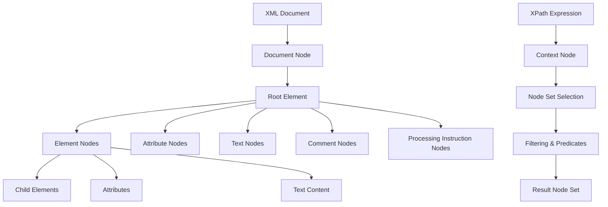

# 🎯 Module 4: Advanced XPath & Querying

**Duration**: 4-5 days | **Difficulty**: Expert | **Prerequisites**: Basic XPath, DOM/SAX parsing knowledge

## 📚 Table of Contents

1. [XPath Architecture Deep Dive](#xpath-architecture-deep-dive)
2. [Advanced Axes Navigation](#advanced-axes-navigation)
3. [Complex Predicates & Filters](#complex-predicates--filters)
4. [Built-in Functions Mastery](#built-in-functions-mastery)
5. [Custom Function Development](#custom-function-development)
6. [Performance Optimization](#performance-optimization)
7. [Namespace-Aware XPath](#namespace-aware-xpath)
8. [Dynamic XPath Generation](#dynamic-xpath-generation)
9. [Real-World Query Patterns](#real-world-query-patterns)
10. [Advanced Debugging Techniques](#advanced-debugging-techniques)

---

## 🏗️ XPath Architecture Deep Dive

### Understanding the XPath Data Model



### XPath 3.1 Advanced Features

```python
from lxml import etree
import re
from typing import List, Dict, Any, Optional
from dataclasses import dataclass

@dataclass
class XPathQuery:
    expression: str
    description: str
    namespace_context: Dict[str, str] = None
    expected_type: str = "nodeset"  # nodeset, string, number, boolean

class AdvancedXPathProcessor:
    def __init__(self):
        self.namespace_context = {}
        self.custom_functions = {}
        self.query_cache = {}
        self.performance_stats = {
            'cache_hits': 0,
            'cache_misses': 0,
            'total_queries': 0
        }
    
    def register_namespace(self, prefix: str, uri: str):
        """Register namespace for XPath queries"""
        self.namespace_context[prefix] = uri
    
    def register_namespaces(self, namespaces: Dict[str, str]):
        """Register multiple namespaces"""
        self.namespace_context.update(namespaces)
    
    def execute_xpath(self, doc_or_element, xpath_expr: str, 
                     use_cache: bool = True) -> Any:
        """Execute XPath with caching and performance tracking"""
        
        cache_key = f"{id(doc_or_element)}:{xpath_expr}"
        
        if use_cache and cache_key in self.query_cache:
            self.performance_stats['cache_hits'] += 1
            return self.query_cache[cache_key]
        
        self.performance_stats['cache_misses'] += 1
        self.performance_stats['total_queries'] += 1
        
        try:
            # Execute XPath with namespace context
            result = doc_or_element.xpath(xpath_expr, namespaces=self.namespace_context)
            
            # Cache result if it's small enough
            if use_cache and len(str(result)) < 10000:  # Cache small results only
                self.query_cache[cache_key] = result
            
            return result
            
        except etree.XPathEvalError as e:
            raise XPathError(f"XPath evaluation failed: {e}")
    
    def analyze_xpath_performance(self, doc, xpath_expressions: List[str], 
                                iterations: int = 100):
        """Analyze performance of multiple XPath expressions"""
        import time
        
        results = {}
        
        for xpath_expr in xpath_expressions:
            times = []
            
            for _ in range(iterations):
                start_time = time.time()
                try:
                    self.execute_xpath(doc, xpath_expr, use_cache=False)
                    times.append(time.time() - start_time)
                except Exception as e:
                    times.append(float('inf'))  # Mark failed queries
            
            valid_times = [t for t in times if t != float('inf')]
            
            results[xpath_expr] = {
                'avg_time': sum(valid_times) / len(valid_times) if valid_times else 0,
                'min_time': min(valid_times) if valid_times else 0,
                'max_time': max(valid_times) if valid_times else 0,
                'success_rate': len(valid_times) / len(times) * 100
            }
        
        return results

class XPathError(Exception):
    """Custom XPath error class"""
    pass

# Example usage
processor = AdvancedXPathProcessor()

# Register namespaces
processor.register_namespaces({
    'book': 'http://example.com/books',
    'author': 'http://example.com/authors',
    'meta': 'http://example.com/metadata'
})

sample_xml = '''<?xml version="1.0"?>
<library xmlns:book="http://example.com/books" 
         xmlns:author="http://example.com/authors"
         xmlns:meta="http://example.com/metadata">
    <book:collection>
        <book:item id="1" category="technical">
            <book:title>Advanced XML Processing</book:title>
            <author:person id="auth1">
                <author:name>John Smith</author:name>
                <author:expertise>XML, XPath</author:expertise>
            </author:person>
            <meta:publication_date>2024-01-15</meta:publication_date>
            <meta:pages>450</meta:pages>
        </book:item>
        <book:item id="2" category="fiction">
            <book:title>The XML Chronicles</book:title>
            <author:person id="auth2">
                <author:name>Jane Doe</author:name>
                <author:expertise>Creative Writing</author:expertise>
            </author:person>
            <meta:publication_date>2023-12-01</meta:publication_date>
            <meta:pages>320</meta:pages>
        </book:item>
    </book:collection>
</library>'''

doc = etree.fromstring(sample_xml.encode('utf-8'))

# Test namespace-aware queries
technical_books = processor.execute_xpath(doc, 
    '//book:item[@category="technical"]/book:title/text()')
print("Technical books:", technical_books)
```

---

## 🧭 Advanced Axes Navigation

### Complete Axes Reference and Usage

```python
class XPathAxesExplorer:
    """Comprehensive XPath axes exploration and examples"""
    
    def __init__(self, document):
        self.doc = document
        self.examples = {}
    
    def demonstrate_all_axes(self):
        """Demonstrate all 13 XPath axes with examples"""
        
        axes_examples = {
            # Forward Axes
            'child': {
                'expression': 'child::book:item',
                'description': 'Select all child book:item elements',
                'short_form': 'book:item'
            },
            
            'descendant': {
                'expression': 'descendant::book:title',
                'description': 'Select all descendant book:title elements',
                'short_form': './/book:title'
            },
            
            'descendant-or-self': {
                'expression': 'descendant-or-self::*[@id]',
                'description': 'Select context node and descendants with id attribute',
                'short_form': './/*[@id] | self::*[@id]'
            },
            
            'following': {
                'expression': 'following::meta:pages',
                'description': 'Select all meta:pages after current node in document order',
                'short_form': None
            },
            
            'following-sibling': {
                'expression': 'following-sibling::book:item',
                'description': 'Select following sibling book:item elements',
                'short_form': None
            },
            
            'attribute': {
                'expression': 'attribute::category',
                'description': 'Select category attribute',
                'short_form': '@category'
            },
            
            'namespace': {
                'expression': 'namespace::*',
                'description': 'Select all namespace nodes',
                'short_form': None
            },
            
            'self': {
                'expression': 'self::book:item',
                'description': 'Select context node if it is book:item',
                'short_form': '.'
            },
            
            # Reverse Axes
            'parent': {
                'expression': 'parent::book:collection',
                'description': 'Select parent if it is book:collection',
                'short_form': '..'
            },
            
            'ancestor': {
                'expression': 'ancestor::library',
                'description': 'Select all ancestor library elements',
                'short_form': None
            },
            
            'ancestor-or-self': {
                'expression': 'ancestor-or-self::*[@xmlns:book]',
                'description': 'Select ancestors and self with book namespace declaration',
                'short_form': None
            },
            
            'preceding': {
                'expression': 'preceding::book:title',
                'description': 'Select all book:title elements before current node',
                'short_form': None
            },
            
            'preceding-sibling': {
                'expression': 'preceding-sibling::book:item',
                'description': 'Select preceding sibling book:item elements',
                'short_form': None
            }
        }
        
        return axes_examples
    
    def demonstrate_complex_navigation(self):
        """Demonstrate complex multi-axis navigation patterns"""
        
        complex_patterns = {
            'ancestor_with_condition': {
                'xpath': 'ancestor::*[descendant::author:name[contains(text(), "John")]]',
                'description': 'Find ancestors that have descendants with "John" in author name'
            },
            
            'sibling_context_switching': {
                'xpath': '''following-sibling::book:item[1]/preceding-sibling::book:item[1]
                           [@category="technical"]''',
                'description': 'Navigate to next sibling, then back to previous if it\'s technical'
            },
            
            'multi_level_back_reference': {
                'xpath': '''book:item[author:person/@id = 
                           following-sibling::book:item/author:person/@id]''',
                'description': 'Find items where author ID matches a following sibling\'s author ID'
            },
            
            'conditional_ancestor_lookup': {
                'xpath': '''self::*[ancestor::*[@category][1]/@category = "technical"]
                           /descendant::meta:pages''',
                'description': 'Get pages if nearest categorized ancestor is technical'
            },
            
            'reverse_axis_filtering': {
                'xpath': '''preceding::book:item[meta:pages > 
                           following::book:item[1]/meta:pages]''',
                'description': 'Find preceding items with more pages than the first following item'
            }
        }
        
        results = {}
        for pattern_name, pattern_info in complex_patterns.items():
            try:
                result = self.doc.xpath(pattern_info['xpath'], 
                                       namespaces={
                                           'book': 'http://example.com/books',
                                           'author': 'http://example.com/authors',
                                           'meta': 'http://example.com/metadata'
                                       })
                results[pattern_name] = {
                    'result': result,
                    'count': len(result) if hasattr(result, '__len__') else 1,
                    'description': pattern_info['description']
                }
            except Exception as e:
                results[pattern_name] = {
                    'error': str(e),
                    'description': pattern_info['description']
                }
        
        return results

# Advanced axes usage examples
def advanced_axes_patterns():
    """Advanced patterns using multiple axes"""
    
    patterns = [
        # Pattern 1: Context-sensitive navigation
        {
            'name': 'Dynamic Context Navigation',
            'xpath': '''//book:item[position() = 1]/following-sibling::book:item
                       [meta:pages > current()/../book:item[1]/meta:pages]''',
            'description': 'Find siblings with more pages than the first item'
        },
        
        # Pattern 2: Cross-reference validation
        {
            'name': 'Cross-Reference Validation',
            'xpath': '''//author:person[@id and not(@id = //book:item
                       [not(author:person/@id = current()/@id)]/author:person/@id)]''',
            'description': 'Find authors not referenced by other items'
        },
        
        # Pattern 3: Hierarchical filtering
        {
            'name': 'Hierarchical Filtering',
            'xpath': '''//book:item[ancestor::book:collection
                       [count(book:item[@category="technical"]) > 
                        count(book:item[@category="fiction"])]]''',
            'description': 'Items in collections with more technical than fiction books'
        },
        
        # Pattern 4: Relative positioning
        {
            'name': 'Relative Positioning',
            'xpath': '''//book:item[following-sibling::book:item[1]/meta:pages > 
                       preceding-sibling::book:item[1]/meta:pages]''',
            'description': 'Items where next sibling has more pages than previous sibling'
        }
    ]
    
    return patterns

# Example usage
doc = etree.fromstring(sample_xml.encode('utf-8'))
explorer = XPathAxesExplorer(doc)

# Demonstrate all axes
axes_demo = explorer.demonstrate_all_axes()
for axis_name, axis_info in axes_demo.items():
    print(f"\n{axis_name.upper()} AXIS:")
    print(f"  Full syntax: {axis_info['expression']}")
    print(f"  Description: {axis_info['description']}")
    if axis_info['short_form']:
        print(f"  Short form: {axis_info['short_form']}")

# Demonstrate complex navigation
complex_demo = explorer.demonstrate_complex_navigation()
print("\n" + "="*50)
print("COMPLEX NAVIGATION PATTERNS:")
print("="*50)

for pattern_name, pattern_result in complex_demo.items():
    print(f"\n{pattern_name.replace('_', ' ').title()}:")
    print(f"  Description: {pattern_result['description']}")
    if 'error' in pattern_result:
        print(f"  Error: {pattern_result['error']}")
    else:
        print(f"  Results: {pattern_result['count']} items found")
```

---

## 🔍 Complex Predicates & Filters

### Advanced Predicate Patterns

```python
class AdvancedPredicates:
    """Advanced XPath predicate patterns and techniques"""
    
    def __init__(self, doc):
        self.doc = doc
        self.namespaces = {
            'book': 'http://example.com/books',
            'author': 'http://example.com/authors',
            'meta': 'http://example.com/metadata'
        }
    
    def demonstrate_predicate_types(self):
        """Demonstrate different types of predicates"""
        
        predicate_examples = {
            # Positional Predicates
            'positional_basic': {
                'xpath': '//book:item[1]',
                'description': 'First book item'
            },
            'positional_last': {
                'xpath': '//book:item[last()]',
                'description': 'Last book item'
            },
            'positional_second_last': {
                'xpath': '//book:item[last()-1]',
                'description': 'Second to last book item'
            },
            'positional_range': {
                'xpath': '//book:item[position() >= 2 and position() <= 4]',
                'description': 'Book items 2 through 4'
            },
            
            # Attribute-based Predicates
            'attribute_exact': {
                'xpath': '//book:item[@category="technical"]',
                'description': 'Items with exact category match'
            },
            'attribute_contains': {
                'xpath': '//book:item[contains(@category, "tech")]',
                'description': 'Items with category containing "tech"'
            },
            'attribute_starts_with': {
                'xpath': '//book:item[starts-with(@category, "tech")]',
                'description': 'Items with category starting with "tech"'
            },
            'attribute_multiple': {
                'xpath': '//book:item[@category and @id]',
                'description': 'Items with both category and id attributes'
            },
            
            # Content-based Predicates
            'text_content': {
                'xpath': '//book:title[contains(text(), "XML")]',
                'description': 'Titles containing "XML"'
            },
            'normalize_space': {
                'xpath': '//author:name[normalize-space(text()) = "John Smith"]',
                'description': 'Author names matching exactly (normalized)'
            },
            'string_length': {
                'xpath': '//book:title[string-length(text()) > 10]',
                'description': 'Titles longer than 10 characters'
            },
            
            # Numeric Predicates
            'numeric_comparison': {
                'xpath': '//book:item[meta:pages > 400]',
                'description': 'Items with more than 400 pages'
            },
            'numeric_calculation': {
                'xpath': '//book:item[meta:pages div 100 > 3]',
                'description': 'Items where pages/100 > 3'
            },
            
            # Boolean Logic Predicates
            'logical_and': {
                'xpath': '''//book:item[@category="technical" and meta:pages > 300]''',
                'description': 'Technical books with more than 300 pages'
            },
            'logical_or': {
                'xpath': '''//book:item[@category="technical" or meta:pages > 400]''',
                'description': 'Technical books OR books with more than 400 pages'
            },
            'logical_not': {
                'xpath': '''//book:item[not(@category="fiction")]''',
                'description': 'Books that are not fiction'
            },
            
            # Existential Predicates
            'has_child': {
                'xpath': '//book:item[meta:pages]',
                'description': 'Items that have pages metadata'
            },
            'has_attribute': {
                'xpath': '//book:item[@category]',
                'description': 'Items that have category attribute'
            },
            'has_text': {
                'xpath': '//book:title[text()]',
                'description': 'Titles that have text content'
            },
            
            # Advanced Comparisons
            'cross_reference': {
                'xpath': '''//book:item[author:person/@id = 
                           following-sibling::book:item/author:person/@id]''',
                'description': 'Items sharing author ID with following sibling'
            },
            'parent_context': {
                'xpath': '''//meta:pages[. > ../preceding-sibling::book:item[1]/meta:pages]''',
                'description': 'Page counts greater than preceding sibling'
            }
        }
        
        results = {}
        for pred_name, pred_info in predicate_examples.items():
            try:
                result = self.doc.xpath(pred_info['xpath'], namespaces=self.namespaces)
                results[pred_name] = {
                    'result': result,
                    'count': len(result) if hasattr(result, '__len__') else 1,
                    'description': pred_info['description'],
                    'xpath': pred_info['xpath']
                }
            except Exception as e:
                results[pred_name] = {
                    'error': str(e),
                    'description': pred_info['description'],
                    'xpath': pred_info['xpath']
                }
        
        return results
    
    def demonstrate_advanced_filtering(self):
        """Demonstrate advanced filtering techniques"""
        
        advanced_filters = {
            # Conditional Filtering
            'conditional_filter': {
                'xpath': '''//book:item[if (@category="technical") 
                           then meta:pages > 300 
                           else meta:pages > 200]''',
                'description': 'Different page requirements based on category',
                'xpath_1_0': '''//book:item[(@category="technical" and meta:pages > 300) or
                               (@category!="technical" and meta:pages > 200)]'''
            },
            
            # Aggregate Filtering
            'avg_comparison': {
                'xpath': '''//book:item[meta:pages > 
                           avg(//book:item/meta:pages)]''',
                'description': 'Items with above-average page count',
                'workaround': 'Use sum() and count() for XPath 1.0'
            },
            
            # Set Operations
            'intersection': {
                'xpath': '''//book:item[@category="technical"] 
                           [meta:pages > 300]''',
                'description': 'Intersection: technical AND > 300 pages'
            },
            
            'union_with_filter': {
                'xpath': '''(//book:item[@category="technical"] | 
                           //book:item[meta:pages > 400])
                           [author:person/author:name[contains(text(), "Smith")]]''',
                'description': 'Union of technical or long books, filtered by author'
            },
            
            # Dynamic Filtering
            'variable_based': {
                'xpath': '''//book:item[meta:pages > 
                           //book:item[@id="1"]/meta:pages]''',
                'description': 'Items with more pages than item with id="1"'
            },
            
            # Pattern-based Filtering
            'regex_like': {
                'xpath': '''//author:expertise[contains(., "XML") and 
                           contains(., "XPath")]''',
                'description': 'Expertise containing both XML and XPath'
            }
        }
        
        results = {}
        for filter_name, filter_info in advanced_filters.items():
            try:
                result = self.doc.xpath(filter_info['xpath'], namespaces=self.namespaces)
                results[filter_name] = {
                    'result': result,
                    'count': len(result) if hasattr(result, '__len__') else 1,
                    'description': filter_info['description'],
                    'xpath': filter_info['xpath']
                }
                
                # Test XPath 1.0 alternative if provided
                if 'xpath_1_0' in filter_info:
                    result_1_0 = self.doc.xpath(filter_info['xpath_1_0'], 
                                               namespaces=self.namespaces)
                    results[filter_name]['xpath_1_0_result'] = result_1_0
                    
            except Exception as e:
                results[filter_name] = {
                    'error': str(e),
                    'description': filter_info['description'],
                    'xpath': filter_info['xpath']
                }
        
        return results

# Example usage with complex data
complex_xml = '''<?xml version="1.0"?>
<library xmlns:book="http://example.com/books" 
         xmlns:author="http://example.com/authors"
         xmlns:meta="http://example.com/metadata">
    <book:collection name="Technical Books">
        <book:item id="1" category="technical" priority="high">
            <book:title>Advanced XML Processing</book:title>
            <author:person id="auth1">
                <author:name>John Smith</author:name>
                <author:expertise>XML, XPath, XSLT</author:expertise>
                <author:experience_years>15</author:experience_years>
            </author:person>
            <meta:publication_date>2024-01-15</meta:publication_date>
            <meta:pages>450</meta:pages>
            <meta:price currency="USD">89.99</meta:price>
        </book:item>
        
        <book:item id="2" category="technical" priority="medium">
            <book:title>XPath Mastery Guide</book:title>
            <author:person id="auth2">
                <author:name>Alice Johnson</author:name>
                <author:expertise>XPath, XQuery</author:expertise>
                <author:experience_years>8</author:experience_years>
            </author:person>
            <meta:publication_date>2023-11-20</meta:publication_date>
            <meta:pages>320</meta:pages>
            <meta:price currency="USD">79.99</meta:price>
        </book:item>
        
        <book:item id="3" category="fiction" priority="low">
            <book:title>The XML Chronicles</book:title>
            <author:person id="auth3">
                <author:name>Bob Smith</author:name>
                <author:expertise>Creative Writing, Fiction</author:expertise>
                <author:experience_years>12</author:experience_years>
            </author:person>
            <meta:publication_date>2023-12-01</meta:publication_date>
            <meta:pages>280</meta:pages>
            <meta:price currency="USD">24.99</meta:price>
        </book:item>
    </book:collection>
</library>'''

doc = etree.fromstring(complex_xml.encode('utf-8'))
predicates = AdvancedPredicates(doc)

# Test predicate patterns
print("PREDICATE PATTERNS:")
print("="*50)
predicate_results = predicates.demonstrate_predicate_types()

for pred_name, pred_result in list(predicate_results.items())[:5]:  # Show first 5
    print(f"\n{pred_name.replace('_', ' ').title()}:")
    print(f"  XPath: {pred_result['xpath']}")
    print(f"  Description: {pred_result['description']}")
    if 'error' in pred_result:
        print(f"  Error: {pred_result['error']}")
    else:
        print(f"  Results: {pred_result['count']} items")

# Test advanced filtering
print("\n\nADVANCED FILTERING:")
print("="*50)
filter_results = predicates.demonstrate_advanced_filtering()

for filter_name, filter_result in filter_results.items():
    print(f"\n{filter_name.replace('_', ' ').title()}:")
    print(f"  Description: {filter_result['description']}")
    if 'error' in filter_result:
        print(f"  Error: {filter_result['error']}")
    else:
        print(f"  Results: {filter_result['count']} items")
        if 'xpath_1_0_result' in filter_result:
            print(f"  XPath 1.0 equivalent: {len(filter_result['xpath_1_0_result'])} items")
```

---

## 🛠️ Built-in Functions Mastery

### Comprehensive Function Categories

```python
class XPathFunctionLibrary:
    """Comprehensive XPath function library with examples"""
    
    def __init__(self, doc):
        self.doc = doc
        self.namespaces = {
            'book': 'http://example.com/books',
            'author': 'http://example.com/authors',
            'meta': 'http://example.com/metadata'
        }
    
    def string_functions(self):
        """Demonstrate string manipulation functions"""
        
        string_functions = {
            # Basic String Functions
            'concat': {
                'xpath': '''//author:person[concat(author:name, " - ", author:expertise)]''',
                'description': 'Concatenate author name and expertise',
                'example_result': '"John Smith - XML, XPath, XSLT"'
            },
            
            'contains': {
                'xpath': '//book:title[contains(., "XML")]',
                'description': 'Titles containing "XML"'
            },
            
            'starts_with': {
                'xpath': '//book:title[starts-with(., "Advanced")]',
                'description': 'Titles starting with "Advanced"'
            },
            
            'ends_with': {
                'xpath': '//book:title[ends-with(., "Guide")]',  # XPath 2.0+
                'description': 'Titles ending with "Guide"',
                'xpath_1_0': '''//book:title[substring(., string-length(.) - 4) = "Guide"]'''
            },
            
            'substring': {
                'xpath': '//meta:publication_date[substring(., 1, 4) = "2024"]',
                'description': 'Publications from 2024 (first 4 characters)'
            },
            
            'substring_before': {
                'xpath': '''//author:expertise[substring-before(., ",")]''',
                'description': 'First skill from comma-separated list'
            },
            
            'substring_after': {
                'xpath': '''//author:expertise[substring-after(., ", ")]''',
                'description': 'Skills after first comma'
            },
            
            'normalize_space': {
                'xpath': '//author:name[normalize-space(.) = "John Smith"]',
                'description': 'Normalized name comparison (removes extra whitespace)'
            },
            
            'translate': {
                'xpath': '''//book:title[translate(., "ABCDEFGHIJKLMNOPQRSTUVWXYZ", 
                           "abcdefghijklmnopqrstuvwxyz")]''',
                'description': 'Case-insensitive title processing'
            },
            
            'string_length': {
                'xpath': '//book:title[string-length(.) > 20]',
                'description': 'Titles longer than 20 characters'
            },
            
            # Advanced String Processing
            'tokenize': {
                'xpath': '''for $skill in tokenize(//author:expertise[1], ",\\s*") 
                           return normalize-space($skill)''',  # XPath 2.0+
                'description': 'Split expertise into individual skills',
                'note': 'Requires XPath 2.0+ processor'
            },
            
            'replace': {
                'xpath': '''//book:title[replace(., "XML", "eXtensible Markup Language")]''',  # XPath 2.0+
                'description': 'Replace XML with full form',
                'note': 'Requires XPath 2.0+ with regex support'
            },
            
            'matches': {
                'xpath': '''//author:name[matches(., "^[A-Z][a-z]+ [A-Z][a-z]+$")]''',  # XPath 2.0+
                'description': 'Names matching "Firstname Lastname" pattern',
                'note': 'Requires XPath 2.0+ with regex support'
            }
        }
        
        return self._execute_function_examples(string_functions)
    
    def numeric_functions(self):
        """Demonstrate numeric functions"""
        
        numeric_functions = {
            # Basic Math Functions
            'number': {
                'xpath': '//book:item[number(meta:pages) > 300]',
                'description': 'Convert pages to number and compare'
            },
            
            'sum': {
                'xpath': 'sum(//meta:pages)',
                'description': 'Total pages across all books'
            },
            
            'count': {
                'xpath': 'count(//book:item[@category="technical"])',
                'description': 'Count of technical books'
            },
            
            'avg': {
                'xpath': 'avg(//meta:pages)',  # XPath 2.0+
                'description': 'Average pages per book',
                'xpath_1_0': 'sum(//meta:pages) div count(//meta:pages)'
            },
            
            'min': {
                'xpath': 'min(//meta:pages)',  # XPath 2.0+
                'description': 'Minimum page count',
                'workaround': 'Use sorting and position() for XPath 1.0'
            },
            
            'max': {
                'xpath': 'max(//meta:pages)',  # XPath 2.0+
                'description': 'Maximum page count'
            },
            
            # Mathematical Operations
            'ceiling': {
                'xpath': '//book:item[ceiling(meta:pages div 100) = 5]',
                'description': 'Books with 400-499 pages (ceiling of pages/100 = 5)'
            },
            
            'floor': {
                'xpath': '//book:item[floor(meta:pages div 100) = 4]',
                'description': 'Books with 400-499 pages (floor of pages/100 = 4)'
            },
            
            'round': {
                'xpath': '//meta:price[round(.) = 80]',
                'description': 'Prices that round to 80'
            },
            
            'abs': {
                'xpath': '''//book:item[abs(meta:pages - 350) < 50]''',  # XPath 2.0+
                'description': 'Books with pages within 50 of 350'
            },
            
            # Format Functions
            'format_number': {
                'xpath': '''//meta:price[format-number(., "$#,##0.00")]''',  # XSLT function
                'description': 'Format price as currency',
                'note': 'Available in XSLT context'
            }
        }
        
        return self._execute_function_examples(numeric_functions)
    
    def boolean_functions(self):
        """Demonstrate boolean functions"""
        
        boolean_functions = {
            'true_false': {
                'xpath': '//book:item[true()]',
                'description': 'All items (true() always returns true)'
            },
            
            'not': {
                'xpath': '//book:item[not(@priority="low")]',
                'description': 'Items that are not low priority'
            },
            
            'boolean': {
                'xpath': '//book:item[boolean(@priority)]',
                'description': 'Items with priority attribute (converts to boolean)'
            },
            
            'lang': {
                'xpath': '//book:item[lang("en")]',
                'description': 'Items in English language context'
            }
        }
        
        return self._execute_function_examples(boolean_functions)
    
    def date_time_functions(self):
        """Demonstrate date and time functions (XPath 2.0+)"""
        
        datetime_functions = {
            'current_date': {
                'xpath': 'current-date()',  # XPath 2.0+
                'description': 'Current date',
                'note': 'Returns current date'
            },
            
            'current_dateTime': {
                'xpath': 'current-dateTime()',  # XPath 2.0+
                'description': 'Current date and time'
            },
            
            'year_from_date': {
                'xpath': '''//book:item[year-from-date(
                           xs:date(meta:publication_date)) = 2024]''',  # XPath 2.0+
                'description': 'Books published in 2024'
            },
            
            'month_from_date': {
                'xpath': '''//book:item[month-from-date(
                           xs:date(meta:publication_date)) = 1]''',  # XPath 2.0+
                'description': 'Books published in January'
            },
            
            'days_from_duration': {
                'xpath': '''//book:item[days-from-duration(
                           current-date() - xs:date(meta:publication_date)) < 365]''',  # XPath 2.0+
                'description': 'Books published within last year'
            }
        }
        
        return datetime_functions  # Note: Most require XPath 2.0+ processor
    
    def node_functions(self):
        """Demonstrate node manipulation functions"""
        
        node_functions = {
            'local_name': {
                'xpath': '//*[local-name() = "item"]',
                'description': 'Elements with local name "item"'
            },
            
            'namespace_uri': {
                'xpath': '//*[namespace-uri() = "http://example.com/books"]',
                'description': 'Elements in books namespace'
            },
            
            'name': {
                'xpath': '//*[name() = "book:item"]',
                'description': 'Elements with qualified name "book:item"'
            },
            
            'generate_id': {
                'xpath': '//book:item[generate-id() = generate-id(//book:item[1])]',
                'description': 'First book item using generate-id()'
            },
            
            'id': {
                'xpath': 'id("auth1")',
                'description': 'Element with ID "auth1" (if DTD/Schema defines ID attribute)'
            }
        }
        
        return self._execute_function_examples(node_functions)
    
    def sequence_functions(self):
        """Demonstrate sequence functions (XPath 2.0+)"""
        
        sequence_functions = {
            'empty': {
                'xpath': '//book:item[empty(meta:isbn)]',  # XPath 2.0+
                'description': 'Items without ISBN'
            },
            
            'exists': {
                'xpath': '//book:item[exists(meta:price)]',  # XPath 2.0+
                'description': 'Items with price information'
            },
            
            'distinct_values': {
                'xpath': 'distinct-values(//book:item/@category)',  # XPath 2.0+
                'description': 'Unique category values'
            },
            
            'index_of': {
                'xpath': '''index-of(("technical", "fiction", "reference"), 
                           //book:item[1]/@category)''',  # XPath 2.0+
                'description': 'Position of first item\'s category in list'
            },
            
            'reverse': {
                'xpath': 'reverse(//book:item)',  # XPath 2.0+
                'description': 'Book items in reverse document order'
            },
            
            'subsequence': {
                'xpath': 'subsequence(//book:item, 2, 2)',  # XPath 2.0+
                'description': 'Items 2-3 from the sequence'
            }
        }
        
        return sequence_functions
    
    def _execute_function_examples(self, function_dict):
        """Execute function examples and return results"""
        results = {}
        
        for func_name, func_info in function_dict.items():
            try:
                result = self.doc.xpath(func_info['xpath'], namespaces=self.namespaces)
                results[func_name] = {
                    'result': result,
                    'type': type(result).__name__,
                    'count': len(result) if hasattr(result, '__len__') else 1,
                    'description': func_info['description'],
                    'xpath': func_info['xpath']
                }
                
                # Add notes if present
                if 'note' in func_info:
                    results[func_name]['note'] = func_info['note']
                    
                # Add XPath 1.0 alternative if present
                if 'xpath_1_0' in func_info:
                    results[func_name]['xpath_1_0'] = func_info['xpath_1_0']
                    
            except Exception as e:
                results[func_name] = {
                    'error': str(e),
                    'description': func_info['description'],
                    'xpath': func_info['xpath']
                }
        
        return results

# Example usage
doc = etree.fromstring(complex_xml.encode('utf-8'))
func_lib = XPathFunctionLibrary(doc)

# Test different function categories
print("STRING FUNCTIONS:")
print("="*50)
string_results = func_lib.string_functions()

for func_name, func_result in list(string_results.items())[:3]:
    print(f"\n{func_name.replace('_', ' ').title()}:")
    print(f"  XPath: {func_result['xpath']}")
    print(f"  Description: {func_result['description']}")
    if 'error' in func_result:
        print(f"  Error: {func_result['error']}")
    else:
        print(f"  Result type: {func_result['type']}")
        if isinstance(func_result['result'], list) and func_result['result']:
            print(f"  Sample: {func_result['result'][0] if func_result['result'] else 'None'}")

print("\n\nNUMERIC FUNCTIONS:")
print("="*50)
numeric_results = func_lib.numeric_functions()

for func_name, func_result in list(numeric_results.items())[:3]:
    print(f"\n{func_name.replace('_', ' ').title()}:")
    print(f"  Description: {func_result['description']}")
    if 'error' in func_result:
        print(f"  Error: {func_result['error']}")
    else:
        print(f"  Result: {func_result['result']}")
```

---

## 🎯 Key Takeaways

✅ **Axes Mastery**: Understand all 13 axes for complex navigation patterns  
✅ **Predicate Power**: Use multiple predicate types for precise filtering  
✅ **Function Library**: Leverage built-in functions for data manipulation  
✅ **Performance**: Optimize XPath expressions for better execution speed  
✅ **Namespace Awareness**: Handle namespaced documents correctly  
✅ **Version Compatibility**: Know XPath 1.0 vs 2.0+ differences  
✅ **Complex Patterns**: Combine axes, predicates, and functions effectively  

---

## 💡 Pro Interview Tips

**Q: "Explain the difference between child:: and descendant:: axes."**
**A:** child:: selects immediate children only (one level down), while descendant:: selects all descendants at any level below. child::book is equivalent to book, descendant::book is equivalent to .//book.

**Q: "How would you optimize this XPath: //book//title//text()?"**
**A:** Use more specific paths like //book/title/text() or .//title/text() from a book context. Avoid multiple // operators as they scan the entire document tree repeatedly.

**Q: "When would you use preceding-sibling vs preceding axes?"**
**A:** preceding-sibling:: selects siblings before the current node at the same level. preceding:: selects ALL nodes before the current node in document order, regardless of hierarchy level.

**Q: "How do you handle case-insensitive string matching in XPath 1.0?"**
**A:** Use translate() function to convert both strings to same case: translate(text(), 'ABCD...', 'abcd...') or contains(translate(text(), 'ABC...', 'abc...'), 'search').

---

🎉 **Exceptional Progress!** You've mastered advanced XPath techniques and complex querying patterns.

**Next**: [XQuery Mastery](./05-XQuery-Guide.md) - Learn FLWOR expressions and advanced XML data processing.