# 🚀 Advanced XML Mastery Guide

**A Complete Professional Learning Path for XML Experts**

> *From fundamentals to enterprise-level expertise with real-world applications*

## 📋 Table of Contents

### 🎯 **Module 1: Advanced XML Namespaces**
- [01-Advanced-Namespaces.md](./01-Advanced-Namespaces.md) - Deep dive into prefixes, collisions, and resolution strategies

### 🔧 **Module 2: Advanced XML Schema (XSD)**  
- [02-Advanced-XSD.md](./02-Advanced-XSD.md) - Complex types, constraints, design patterns, and versioning

### ⚡ **Module 3: Parsing Performance & Optimization**
- [03-Parsing-Performance.md](./03-Parsing-Performance.md) - DOM vs SAX vs StAX, streaming, memory optimization

### 🎯 **Module 4: Advanced XPath & Querying**
- [04-Advanced-XPath.md](./04-Advanced-XPath.md) - Axes, predicates, functions, and complex queries

### 🔍 **Module 5: XQuery Mastery**
- [05-XQuery-Guide.md](./05-XQuery-Guide.md) - FLWOR expressions, filtering, ordering, joining datasets

### 🎨 **Module 6: Advanced XSLT Transformations**
- [06-Advanced-XSLT.md](./06-Advanced-XSLT.md) - Templates, modes, imports, and best practices

### 🔐 **Module 7: XML Security & Binary XML**
- [07-Security-Binary-XML.md](./07-Security-Binary-XML.md) - XXE prevention, EXI, performance optimization

### 🌍 **Module 8: Real-World Applications**
- [08-Real-World-Applications.md](./08-Real-World-Applications.md) - SOAP, WSDL, RSS/Atom, SVG, enterprise configs

### 🎖️ **Module 9: Best Practices & Modern Context**
- [09-Best-Practices-Modern-Context.md](./09-Best-Practices-Modern-Context.md) - XML vs JSON, design patterns, interview prep

---

## 🎓 Learning Path Overview

```mermaid
graph TD
    A[XML Fundamentals ✓] --> B[Advanced Namespaces]
    B --> C[Advanced XSD]
    C --> D[Parsing Performance]
    D --> E[Advanced XPath]
    E --> F[XQuery]
    F --> G[Advanced XSLT]
    G --> H[Security & Binary XML]
    H --> I[Real-World Applications]
    I --> J[Best Practices & Modern Context]
    J --> K[🏆 XML Expert]
```

## ⏱️ Estimated Timeline

- **Total Duration**: 4-6 weeks (2-3 hours/day)
- **Each Module**: 3-5 days
- **Hands-on Practice**: 40% of time
- **Theory & Reading**: 60% of time

## 🎯 Learning Objectives

By completing this guide, you will:

✅ **Master XML namespace management** for enterprise applications  
✅ **Design robust XSD schemas** with advanced constraints and patterns  
✅ **Optimize XML parsing** for high-performance applications  
✅ **Write complex XPath queries** for data extraction  
✅ **Use XQuery** for advanced XML data manipulation  
✅ **Create sophisticated XSLT transformations**  
✅ **Implement XML security** best practices  
✅ **Apply XML** to real-world enterprise scenarios  
✅ **Make informed decisions** about XML vs alternatives  

## 🛠️ Prerequisites

- ✅ XML Basics (syntax, elements, attributes)
- ✅ Basic DTD/XSD knowledge
- ✅ Programming experience (Python, Java, or JavaScript)
- ✅ Understanding of well-formed vs valid XML

## � Resources & Tools

### Code Examples Available In:
- **Python** - `lxml`, `xml.etree.ElementTree`, `saxutils`
- **Java** - `DOM`, `SAX`, `StAX`, `JAXB`, `Saxon`
- **JavaScript** - `DOMParser`, `XMLHttpRequest`, node.js `xml2js`

### Recommended Tools:
- **XML Editors**: XMLSpy, Oxygen XML Author, VS Code with XML extensions
- **Validators**: W3C Validator, xmllint, Saxon-EE
- **Performance Testing**: JMeter, Apache Bench

---

## 🎮 Interactive Elements

Each module includes:
- 📊 **Comparison Tables** - Side-by-side feature analysis
- 🏗️ **Architecture Diagrams** - Visual parsing models and data flow
- 💻 **Code Laboratories** - Hands-on exercises with solutions
- 🧪 **Mini Challenges** - Practice problems and quizzes
- 💡 **Pro Tips** - Industry insights and best practices
- 🎯 **Interview Prep** - Common questions and expert answers

---

## 🌟 Quick Start

1. **Clone/Download** this repository
2. **Start with Module 1** - Advanced Namespaces
3. **Follow the sequence** - Each module builds on previous concepts  
4. **Practice actively** - Run all code examples
---

*Ready to become an XML expert? Let's begin with [Advanced Namespaces](./01-Advanced-Namespaces.md)! �*
- XSD 1.0/1.1, XPath 2.0/3.0/3.1
- XQuery 1.0/3.0/3.1, XSLT 1.0/2.0/3.0
- XML Signature, XML Encryption, XML-EXI

## 📝 Assessment & Practice

### Continuous Assessment
- **Code Reviews** - Weekly coding assignments with detailed feedback
- **Mini-Projects** - Real-world scenarios after each module
- **Performance Challenges** - Optimization exercises with benchmarking
- **Security Audits** - Vulnerability assessment exercises

### Capstone Project Options
1. **Enterprise XML Processing Pipeline** - Complete data processing system
2. **XML Security Framework** - Comprehensive security toolkit
3. **High-Performance XML Database** - Custom storage and query engine
4. **XML Transformation Engine** - Advanced XSLT processing framework

## 🎯 Career Preparation

### Interview Topics Covered
- XML architecture design patterns
- Performance optimization strategies  
- Security vulnerability assessment
- Technology selection rationale
- Troubleshooting complex XML systems

### Industry Applications
- **Financial Services** - FIX protocol, FpML derivatives
- **Healthcare** - HL7, FHIR medical records
- **Government** - NIEM data standards
- **Publishing** - EPUB, DocBook formats
- **Web Services** - SOAP, REST with XML payloads

## 📈 Estimated Timeline

**Total Duration**: 8-12 weeks (depending on depth and practice time)

- **Phase 1**: 3-4 weeks (Core advanced concepts)
- **Phase 2**: 2-3 weeks (Query and transformation mastery)  
- **Phase 3**: 2-3 weeks (Enterprise and security focus)
- **Phase 4**: 1-2 weeks (Best practices and mastery)

**Recommended Schedule**: 10-15 hours per week for optimal learning pace

## 🚀 Getting Started

1. **Ensure Prerequisites**: Complete XML-Fundamentals series first
2. **Set Up Development Environment**: Install required tools and IDEs
3. **Create Practice Workspace**: Set up version control for your exercises
4. **Start with Module 01**: Advanced Namespaces & URI Management
5. **Follow the Learning Path**: Complete modules sequentially for best results

---

**Ready to become an XML expert?** Let's dive deep into advanced XML technologies and real-world applications! 🎯

Each module includes:
- 📖 **Theory & Concepts** - Deep technical explanations
- 💻 **Hands-on Examples** - Working code in multiple languages  
- 🔧 **Practical Exercises** - Real-world problem solving
- 📊 **Performance Analysis** - Benchmarking and optimization
- 🔒 **Security Considerations** - Best practices and vulnerability prevention
- 🎯 **Interview Preparation** - Key talking points and technical questions